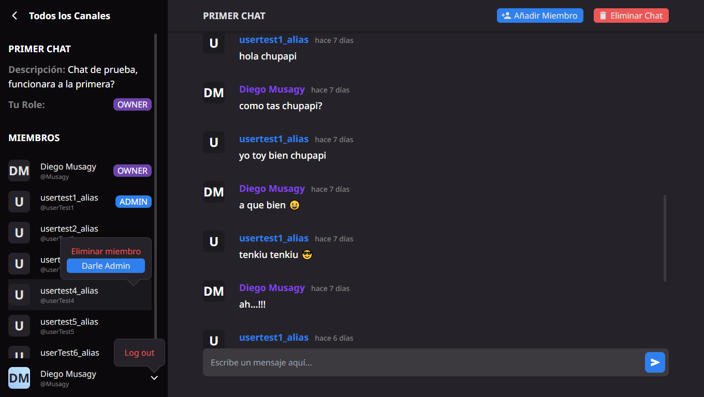

<!-- Please update value in the {}  -->

<h1 align="center">⭐ Chat Group ⭐</h1>

<div align="center">
   Solución para el reto de  <a href="https://legacy.devchallenges.io" target="_blank">Devchallenges.io</a>.
</div>

<div align="center">
  <h3>
    <a href="https://{your-demo-link.your-domain}">
      Demo
    </a>
    <span> | </span>
    <a href="https://{your-url-to-the-solution}">
      Solution
    </a>
    <span> | </span>
    <a href="https://legacy.devchallenges.io/challenges/UgCqszKR7Q7oqb4kRfI0">
      Challenge
    </a>
  </h3>
</div>

<!-- TABLE OF CONTENTS -->

## Tabla de contenido

- [Descripción general](#descripci%C3%B3n-general)
  - [Hecho con](#hecho-con)
- [Features | Características](#features--caracter%C3%ADsticas)
- [How to use](#como-usarlo-tu-mismo)
- [Agradecimientos](#agradecimientos)
- [Contacto](#contactos)

<!-- OVERVIEW -->

## Descripción general



> Este **proyecto** fue creado en para llevar a prueba mis conocimientos en Java y Spring individualmente sin ayuda de un curso destinado


### Hecho con

- [React](https://reactjs.org/)
- [Tailwind](https://tailwindcss.com/)
- [Spring Boot](https://spring.io/)
- [Docker](https://www.docker.com)

## Features | Características

> Si tiene ✔️ ya esta agregado.
> Si tiene ❌ aun no esta agregada la característica.

- De forma predeterminada, estoy en el canal de bienvenida ❌
- Puedo crear un nuevo canal con un nombre y una descripción ✔️
- Puedo seleccionar un canal de mi elección ✔️
- Cuando puedo seleccionar un canal, se me agrega como miembro del canal ❌
- Puedo ver a un miembro del canal ✔️
- Puedo enviar un mensaje ✔️
- Puedo ver los mensajes de otras personas ✔️
- Puedo buscar un grupo ❌

## Como usarlo tu mismo.

Si quieres usar este proyecto en tu maquina local, necesitas solo y obligatoriamente [Docker](https://www.docker.com) instalado en tu maquina.

```bash
# Clone el proyecto y he ingresa a la carpeta
$ git clone https://github.com/Musagy/chat-group

# Inicial el docker compose
$ docker-compose up -d
```

## Agradecimientos

- [Dockerizar API REST Java + Spring Boot con PostgreSQL y Docker Compose 2023](https://www.youtube.com/watch?v=uqBZEL9m2V4)
- [Claude AI](https://claude.ai)

## Contactos

**Musagy**

- Website [musagy.dev.com](https://musagy.dev)
- GitHub [@Musagy](https://github.com/Musagy)